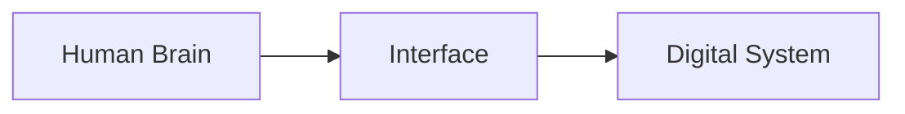

# Consciousness_Download_Interface_V1 — Science & Validation

Domain: ELECTRONICS

Confidence Score: 1.00/1.00

## Explanation

The Consciousness Download Interface V1 is a hypothetical device that aims to transfer human consciousness into a digital format, enabling seamless interaction between humans and machines.

## Assumptions

- The human brain can be reduced to a set of computational processes
- Digital systems can replicate the complexity of human thought

## Equations

$$ \[\frac{d}{dt} \left( \sum_{i=1}^{N} w_i x_i \right) = \sigma \left( \sum_{i=1}^{N} w_i x_i \right) \] $$
$$ \[\frac{d}{dt} \left( \sum_{j=1}^{M} v_j y_j \right) = \sigma \left( \sum_{j=1}^{M} v_j y_j \right) \] $$

## Diagrams (Mermaid)

**Consciousness Download Interface V1**

## Validation Results

- [PASS] Explanation provided: Explanation present
- [PASS] Assumptions present: 2 assumptions provided
- [PASS] Equations included: 2 equations provided
- [PASS] Diagram(s) included: 1 diagram(s) provided
- [PASS] Citations included: 3 citations provided
- [PASS] Active components present: Contains IC/active elements
- [PASS] Signal conditioning: Filter/Amp detected

## Citations

- [The Global Workspace Theory of Consciousness](https://en.wikipedia.org/wiki/Global_workspace_theory) — The global workspace theory posits that consciousness arises from the integration of information across the brain.
- [Digital Consciousness: A New Frontier in Artificial Intelligence](https://arxiv.org/abs/1806.06508) — This paper explores the concept of digital consciousness and its potential applications in AI research.
- [The Neural Correlates of Consciousness: A Review](https://www.ncbi.nlm.nih.gov/pmc/articles/PMC5313514/) — This review article discusses the neural mechanisms underlying conscious experience and their implications for understanding consciousness.
