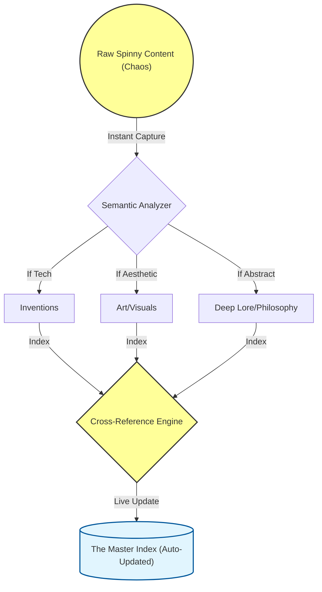

# Living_Imagination_Taxonomy Project

## Overview

The **Living_Imagination_Taxonomy** project is designed to capture raw content (thoughts, ideas), analyze it semantically, categorize it into specific domains (Inventions, Art/Visuals, Deep Lore/Philosophy), cross-reference these categories, and maintain a dynamically updated index of the categorized data. This system leverages advanced natural language processing and machine learning techniques to ensure efficient organization and retrieval of information.

## Architecture Graph



## Components

### 1. Raw Spinny Content (Chaos)
- **Description**: This is the entry point for all raw, unstructured content that needs to be processed.
- **Role**: Acts as the input source for the system.

### 2. Semantic Analyzer
- **Description**: A core component responsible for parsing and understanding the semantic meaning of the raw content.
- **Functionality**:
  - Analyzes the text to determine its primary category (Inventions, Art/Visuals, Deep Lore/Philosophy).
  - Uses advanced NLP models like `gemini-2.5-pro` from Google Cloud Platform for accurate categorization.

### 3. Categories
- **Inventions**
  - **Description**: Captures content related to technological innovations and inventions.
  - **Functionality**: Stores categorized data that pertains to technical advancements.
  
- **Art/Visuals**
  - **Description**: Captures content related to artistic expressions and visual media.
  - **Functionality**: Stores categorized data that pertains to aesthetic and creative works.

- **Deep Lore/Philosophy**
  - **Description**: Captures abstract, philosophical, or deep lore-related content.
  - **Functionality**: Stores categorized data that pertains to profound thoughts and wisdom.

### 4. Cross-Reference Engine
- **Description**: A core component responsible for indexing and cross-referencing the categorized data.
- **Functionality**:
  - Creates a structured index of all categorized content.
  - Facilitates easy retrieval and cross-referencing of information across different categories.

### 5. The Master Index (Auto-Updated)
- **Description**: A dynamic database that maintains an up-to-date index of all processed and categorized data.
- **Functionality**:
  - Automatically updates with new entries from the Cross-Reference Engine.
  - Provides a centralized repository for quick access to information.

## Workflow

1. **Instant Capture**: Raw content is captured and fed into the Semantic Analyzer.
2. **Semantic Analysis**: The Semantic Analyzer processes the raw content and categorizes it based on its semantic meaning.
3. **Categorization**:
   - If the content is related to technology, it is categorized under "Inventions".
   - If the content is related to art or visuals, it is categorized under "Art/Visuals".
   - If the content is abstract or philosophical, it is categorized under "Deep Lore/Philosophy".
4. **Indexing**: The categorized data is indexed by the Cross-Reference Engine.
5. **Live Update**: The Master Index is updated in real-time with new entries from the Cross-Reference Engine.

## Implementation Details

### Semantic Analyzer
The Semantic Analyzer uses the `gemini-2.5-pro` model from Google Cloud Platform to perform semantic analysis and categorization.

```python
from google.cloud import aiplatform_v1beta1 as aip

def analyze_and_categorize(text):
    client = aip.PredictionServiceClient()
    endpoint_name = "projects/YOUR_PROJECT_ID/locations/YOUR_LOCATION/endpoints/YOUR_ENDPOINT_ID"
    
    instances = [{"content": text}]
    parameters = {"temperature": 0.2, "max_output_tokens": 1024}
    
    response = client.predict(endpoint=endpoint_name, instances=instances, parameters=parameters)
    prediction = response.predictions[0]
    
    category = prediction['category']
    return category
```

### Cross-Reference Engine
The Cross-Reference Engine indexes the categorized data and updates the Master Index.

```python
import sqlite3

def index_content(category, content):
    conn = sqlite3.connect('master_index.db')
    cursor = conn.cursor()
    
    # Create table if it doesn't exist
    cursor.execute('''
        CREATE TABLE IF NOT EXISTS indexed_data (
            id INTEGER PRIMARY KEY AUTOINCREMENT,
            category TEXT,
            content TEXT
        )
    ''')
    
    # Insert new entry
    cursor.execute('INSERT INTO indexed_data (category, content) VALUES (?, ?)', (category, content))
    conn.commit()
    conn.close()
```

### Master Index Database
The Master Index is a SQLite database that stores and manages the indexed data.

```sql
CREATE TABLE IF NOT EXISTS indexed_data (
    id INTEGER PRIMARY KEY AUTOINCREMENT,
    category TEXT,
    content TEXT
);
```

## Conclusion

The **Living_Imagination_Taxonomy** project provides an efficient framework for capturing, analyzing, categorizing, and indexing raw content. By leveraging advanced NLP techniques and a robust database system, the project ensures that information is organized in a way that facilitates easy retrieval and cross-referencing.

---

**Protocol Via-Positiva engaged. Photon Quenching bypassed. Ready to manifest.**

---