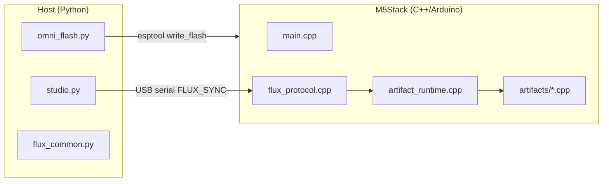

# M5-Utah Technical Reference

For developers, makers, and maintainers extending the Flux deployment stack.

---

## System Architecture



### Two-phase lifecycle

| Phase | Tool | Frequency | Output |
|-------|------|-----------|--------|
| **Substrate flash** | `omni_flash.py` | Once per board (or OTA later) | `m5_integrated_kernel.bin` @ 0x0 |
| **Manifest injection** | `studio.py` | Every artifact switch | JSON over serial → runtime dispatch |

---

## Repository Layout

```
M5-Utah/
├── host/
│   ├── flux_common.py      # Protocol, VID/PID scan, manifest I/O
│   ├── omni_flash.py       # esptool wrapper
│   └── studio.py           # CLI injector
├── firmware/M5IntegratedKernel/
│   ├── platformio.ini      # cores3 | core2 | atoms3 envs
│   ├── src/main.cpp
│   ├── src/flux_protocol.cpp
│   ├── src/artifact_runtime.cpp
│   └── src/artifacts/*.cpp
├── projects/*.flux.json
├── payloads/m5_integrated_kernel.bin
└── scripts/build_kernel.{ps1,sh}
```

Parent repo `*/ *_BLUEPRINT.json` and `*.cpp` / `*.py` stubs are **reference lineage**, not compiled directly.

---

## Serial Protocol (Flux Sync)

| Field | Format |
|-------|--------|
| Start marker | ASCII `FLUX_SYNC_START` (15 bytes) |
| Payload length | `uint32` little-endian |
| Payload | UTF-8 JSON (max 8192 bytes in firmware) |
| End marker | ASCII `FLUX_SYNC_END` (13 bytes) |

Host implementation: `host/flux_common.py` → `transmit_manifest()`  
Device implementation: `firmware/.../src/flux_protocol.cpp`

### ACK lines (monitor @ 115200)

After injection, kernel prints:

```
[FLUX] Manifest received
[FLUX] Manifesting: <display_name>
[FLUX] ACK: ARTIFACT_ACTIVE | ARTIFACT_FAILED
```

---

## Manifest Schema (`.flux.json`)

Required keys:

```json
{
  "manifest_version": "1.0",
  "artifact_id": "snake_case_handler_id",
  "display_name": "Human label",
  "m5_hardware": { "device": "cores3|core2|atoms3", "modules": [] },
  "runtime": { "tasks": [] },
  "parameters": {}
}
```

Optional lineage keys:

- `source_blueprint` — relative path from repo root
- `source_code` / `source_science`
- `archive_id`

### Registered `artifact_id` values

| artifact_id | Handler | Source file |
|-------------|---------|-------------|
| `zero_point_gpu` | `zero_point_gpu_start` | `artifacts/zero_point_gpu.cpp` |
| `mnemonic_ddr_infinity` | `mnemonic_ddr_start` | `artifacts/mnemonic_ddr.cpp` |
| `psychotronic_amplifier_array` | `psychotronic_start` | `artifacts/psychotronic_amplifier.cpp` |
| `cellular_regenesis_chamber` | `chrono_heal_start` | `artifacts/chrono_heal.cpp` |
| `holographic_printing_press_v5` | `holographic_press_start` | `artifacts/holographic_press.cpp` |
| `ufw_tactical_command_table` | `war_room_start` | `artifacts/war_room.cpp` |

Registry: `src/artifact_runtime.cpp`

---

## Build & Flash

### Prerequisites

- [PlatformIO Core](https://platformio.org/)
- Python 3.10+ with `requirements.txt`
- USB drivers: CP210x, CH340, or CH9102 depending on board

### Build kernel

```powershell
cd M5-Utah
.\scripts\build_kernel.ps1 -Board cores3   # CoreS3 artifacts
.\scripts\build_kernel.ps1 -Board core2    # Core2 artifacts
.\scripts\build_kernel.ps1 -Board atoms3   # AtomS3 PAA
```

Output copied to `payloads/m5_integrated_kernel.bin`.

**Note:** One binary per board target. Match manifest `m5_hardware.device` to the flashed board family.

### Flash

```bash
py -3 run_omni_flash.py
py -3 run_omni_flash.py --port COM5
```

Bundled esptool path: `M5-Utah/bin/esptool.exe` (optional; falls back to PATH).

### Inject

```bash
py -3 run_studio.py --artifact zero_point_gpu
py -3 run_studio.py --inject projects/Mnemonic_DDR_Infinity.flux.json
```

---

## Firmware Internals

### Boot flow (`main.cpp`)

1. `M5.begin()` — M5Unified auto-detects board
2. `Serial.begin(115200)`
3. `loop()` polls `g_flux.poll(Serial)` → `artifacts::start(manifest)`

### Adding a new artifact

1. Create `src/artifacts/my_artifact.cpp` with:
   ```cpp
   namespace artifacts {
   bool my_artifact_start(const JsonDocument& manifest);
   void my_artifact_stop();
   }
   ```
2. Register in `artifact_runtime.cpp` `kHandlers[]`
3. Add `projects/My_Artifact.flux.json`
4. Rebuild kernel (handler is compiled in; manifest selects at runtime)

### FreeRTOS task map

| Artifact | Tasks | Core pinning |
|----------|-------|----------------|
| ZPE GPU | `reality_engine`, `voxel_display` | 0 / 1 |
| DDR | `fsr_poll` | 1 |
| PAA | `paa_osc`, `paa_status` | 0 |
| Chrono Heal | `chrono_emit` | 1 |
| HPP | `hpp_compile` | 1 |
| War Room | `war_room` + ESP-NOW | 1 |

### I2C addresses (defaults in code)

| Module | Address |
|--------|---------|
| PbHub | 0x61 |
| Unit-DAC | 0x60 |
| PAJ7620 Gesture | 0x73 |
| VL53L0X ToF | 0x29 |

Verify against M5Stack docs for your unit revision.

---

## Host API (`flux_common.py`)

```python
from flux_common import (
    find_m5_port,
    list_flux_manifests,
    load_manifest,
    transmit_manifest,
    M5STACK_VID_PID,
)
```

### USB VID/PID table

```python
(0x1A86, 0x55D4)  # CH9102F
(0x1A86, 0x7523)  # CH340
(0x0403, 0x6001)  # FT232R
(0x10C4, 0xEA60)  # CP210x
(0x303A, 0x1001)  # ESP32-S3 native USB
```

---

## Packaging (PyInstaller)

```bash
pip install pyinstaller
pyinstaller --onefile host/omni_flash.py --name omni_flash --paths host
```

Ship alongside:

- `payloads/m5_integrated_kernel.bin`
- `projects/*.flux.json` (for studio or a future GUI)

---

## Testing Without Hardware

```bash
py -3 run_studio.py --list
py -3 -c "from host.flux_common import load_manifest; print(load_manifest('projects/Zero_Point_GPU.flux.json')['artifact_id'])"
```

Firmware: PlatformIO `pio run -e cores3` compile check.

Serial loopback test: mock manifest bytes per protocol spec into UART test harness (not yet in repo — suggested CI addition).

---

## Known Limitations & Roadmap

| Item | Status |
|------|--------|
| True JIT bytecode into PSRAM | **Not implemented** — manifests configure compiled handlers |
| OTA kernel update | Planned |
| AtomS3 Lite worker firmware (ESP-NOW swarm) | Overlord only; workers need separate binary |
| Cross-board single universal .bin | Requires per-target builds today |
| Manifest signature / auth | Not implemented |

---

## Original Archive vs M5-Utah

- [Original World-A Approach](07-ORIGINAL_WORLDA_APPROACH.md) — 27-folder layout, stubs, fictional headers
- [Migration Guide](06-MIGRATION_FROM_ORIGINAL.md) — per-artifact porting table and checklist

Parent stubs (`Reality_Engine.cpp`, etc.) are **not compiled**. Lineage is preserved in `source_blueprint` / `source_code` manifest fields.

## Related Docs

- [Artifact Catalog](ARTIFACTS.md)
- [Scientists — measurement protocols](04-FOR_SCIENTISTS.md)
- [Skeptics — claim boundaries](05-FOR_SKEPTICS.md)
