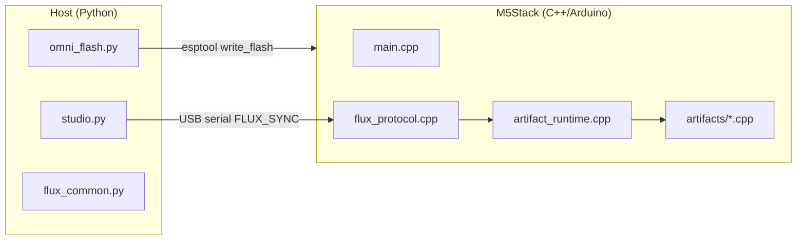

# M5-Utah tehniline viide

Arendajatele, tegijatele ja Fluxi paigutuse pinu hooldajatele.

---

## Süsteemi arhitektuur



### Kahefaasiline elutsükkel

| Faas | Tööriist | Sagedus | Väljund |
|------|----------|---------|---------|
| **Substraadi kirjutamine** | `omni_flash.py` | Üks kord plaadi kohta (või OTA hiljem) | `m5_integrated_kernel.bin` @ 0x0 |
| **Manifesti süstimine** | `studio.py` | Iga artefakti vahetusel | JSON üle jadapordi → runtime dispatch |

---

## Repo paigutus

```
M5-Utah/
├── host/
│   ├── flux_common.py      # Protokoll, VID/PID skaneerimine, manifesti I/O
│   ├── omni_flash.py       # esptool wrapper
│   └── studio.py           # CLI süstija
├── firmware/M5IntegratedKernel/
│   ├── platformio.ini      # cores3 | core2 | atoms3 envs
│   ├── src/main.cpp
│   ├── src/flux_protocol.cpp
│   ├── src/artifact_runtime.cpp
│   └── src/artifacts/*.cpp
├── projects/*.flux.json
├── payloads/m5_integrated_kernel.bin
└── scripts/build_kernel.{ps1,sh}
```

Vanemrepo `*/ *_BLUEPRINT.json` ja `*.cpp` / `*.py` stubid on **viite päritolu**, neid ei kompileerita otse.

---

## Jadapordi protokoll (Flux Sync)

| Väli | Formaat |
|------|---------|
| Algusmarker | ASCII `FLUX_SYNC_START` (15 baiti) |
| Payloadi pikkus | `uint32` little-endian |
| Payload | UTF-8 JSON (max 8192 baiti püsivaras) |
| Lõpumarker | ASCII `FLUX_SYNC_END` (13 baiti) |

Hosti implementatsioon: `host/flux_common.py` → `transmit_manifest()`  
Seadme implementatsioon: `firmware/.../src/flux_protocol.cpp`

### ACK read (monitor @ 115200)

Pärast süstimist prindib kernel:

```
[FLUX] Manifest received
[FLUX] Manifesting: <display_name>
[FLUX] ACK: ARTIFACT_ACTIVE | ARTIFACT_FAILED
```

---

## Manifesti skeem (`.flux.json`)

Kohustuslikud võtmed:

```json
{
  "manifest_version": "1.0",
  "artifact_id": "snake_case_handler_id",
  "display_name": "Human label",
  "m5_hardware": { "device": "cores3|core2|atoms3", "modules": [] },
  "runtime": { "tasks": [] },
  "parameters": {}
}
```

Valikulised päritolu võtmed:

- `source_blueprint` — suhteline tee repo juurest
- `source_code` / `source_science`
- `archive_id`

### Registreeritud `artifact_id` väärtused

| artifact_id | Handler | Lähtefail |
|-------------|---------|-----------|
| `zero_point_gpu` | `zero_point_gpu_start` | `artifacts/zero_point_gpu.cpp` |
| `mnemonic_ddr_infinity` | `mnemonic_ddr_start` | `artifacts/mnemonic_ddr.cpp` |
| `psychotronic_amplifier_array` | `psychotronic_start` | `artifacts/psychotronic_amplifier.cpp` |
| `cellular_regenesis_chamber` | `chrono_heal_start` | `artifacts/chrono_heal.cpp` |
| `holographic_printing_press_v5` | `holographic_press_start` | `artifacts/holographic_press.cpp` |
| `ufw_tactical_command_table` | `war_room_start` | `artifacts/war_room.cpp` |

Register: `src/artifact_runtime.cpp`

---

## Ehitamine ja kirjutamine

### Eeltingimused

- [PlatformIO Core](https://platformio.org/)
- Python 3.10+ koos `requirements.txt`
- USB-draiverid: CP210x, CH340 või CH9102 sõltuvalt plaadist

### Kerneli ehitamine

```powershell
cd M5-Utah
.\scripts\build_kernel.ps1 -Board cores3   # CoreS3 artefaktid
.\scripts\build_kernel.ps1 -Board core2    # Core2 artefaktid
.\scripts\build_kernel.ps1 -Board atoms3   # AtomS3 PAA
```

Väljund kopeeritakse `payloads/m5_integrated_kernel.bin`.

**Märkus:** Üks binaarfail sihtmärgi kohta. Manifesti `m5_hardware.device` peab vastama kirjutatud plaadi perele.

### Kirjutamine

```bash
py -3 run_omni_flash.py
py -3 run_omni_flash.py --port COM5
```

Kaasasolev esptooli tee: `M5-Utah/bin/esptool.exe` (valikuline; kasutab PATH-i, kui puudub).

### Süstimine

```bash
py -3 run_studio.py --artifact zero_point_gpu
py -3 run_studio.py --inject projects/Mnemonic_DDR_Infinity.flux.json
```

---

## Püsivara sisemus

### Käivitamise voog (`main.cpp`)

1. `M5.begin()` — M5Unified tuvastab plaadi automaatselt
2. `Serial.begin(115200)`
3. `loop()` küsib `g_flux.poll(Serial)` → `artifacts::start(manifest)`

### Uue artefakti lisamine

1. Loo `src/artifacts/my_artifact.cpp`:
   ```cpp
   namespace artifacts {
   bool my_artifact_start(const JsonDocument& manifest);
   void my_artifact_stop();
   }
   ```
2. Registreeri `artifact_runtime.cpp` `kHandlers[]`
3. Lisa `projects/My_Artifact.flux.json`
4. Ehita kernel uuesti (handler kompileeritakse sisse; manifest valib runtime'is)

### FreeRTOS ülesannete kaart

| Artefakt | Ülesanded | Tuumade kinnitamine |
|----------|-----------|---------------------|
| ZPE GPU | `reality_engine`, `voxel_display` | 0 / 1 |
| DDR | `fsr_poll` | 1 |
| PAA | `paa_osc`, `paa_status` | 0 |
| Chrono Heal | `chrono_emit` | 1 |
| HPP | `hpp_compile` | 1 |
| War Room | `war_room` + ESP-NOW | 1 |

### I2C aadressid (vaikimisi koodis)

| Moodul | Aadress |
|--------|---------|
| PbHub | 0x61 |
| Unit-DAC | 0x60 |
| PAJ7620 Gesture | 0x73 |
| VL53L0X ToF | 0x29 |

Kontrolli M5Stacki dokumentatsioonist oma üksuse revisjoni jaoks.

---

## Hosti API (`flux_common.py`)

```python
from flux_common import (
    find_m5_port,
    list_flux_manifests,
    load_manifest,
    transmit_manifest,
    M5STACK_VID_PID,
)
```

### USB VID/PID tabel

```python
(0x1A86, 0x55D4)  # CH9102F
(0x1A86, 0x7523)  # CH340
(0x0403, 0x6001)  # FT232R
(0x10C4, 0xEA60)  # CP210x
(0x303A, 0x1001)  # ESP32-S3 native USB
```

---

## Pakendamine (PyInstaller)

```bash
pip install pyinstaller
pyinstaller --onefile host/omni_flash.py --name omni_flash --paths host
```

Saada kaasa:

- `payloads/m5_integrated_kernel.bin`
- `projects/*.flux.json` (studio või tulevase GUI jaoks)

---

## Testimine ilma riistvarata

```bash
py -3 run_studio.py --list
py -3 -c "from host.flux_common import load_manifest; print(load_manifest('projects/Zero_Point_GPU.flux.json')['artifact_id'])"
```

Püsivara: PlatformIO `pio run -e cores3` kompileerimiskontroll.

Jadapordi loopback test: mock manifesti baitid protokolli spetsifikatsiooni järgi UART test harnessi (veel repos puudub — soovitatud CI lisandus).

---

## Teadaolevad piirangud ja teekaart

| Punkt | Olek |
|-------|------|
| Tõeline JIT baitkood PSRAM-i | **Pole implementeeritud** — manifestid konfigureerivad kompileeritud handlereid |
| OTA kerneli uuendus | Planeeritud |
| AtomS3 Lite worker püsivara (ESP-NOW swarm) | Ainult Overlord; workerite jaoks vaja eraldi binaari |
| Ühe universaalse .bin rist-plaadid | Täna vaja ehitust sihtmärgi kohta |
| Manifesti allkiri / autentimine | Pole implementeeritud |

---

## Algne arhiiv vs M5-Utah

- [Algne World-A lähenemine](07-ORIGINAL_WORLDA_APPROACH.md) — 27-kaustaline paigutus, stubid, fiktiivsed päised
- [Migratsioonijuhend](06-MIGRATION_FROM_ORIGINAL.md) — artefaktipõhine portimistabel ja kontrollnimekiri

Vanemad stubid (`Reality_Engine.cpp` jne) **ei kompileeru**. Päritolu säilib manifesti väljades `source_blueprint` / `source_code`.

## Seotud dokumendid

- [Artefaktide kataloog](ARTIFACTS.md)
- [Teadlastele — mõõtmisprotokollid](04-FOR_SCIENTISTS.md)
- [Skeptikutele — väidete piirid](05-FOR_SKEPTICS.md)
