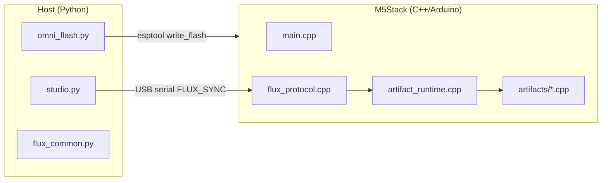

# M5-Utah — tekninen viite

Kehittäjille, tekijöille ja ylläpitäjille, jotka laajentavat Flux-käyttöönottojärjestelmää.

---

## Järjestelmäarkkitehtuuri



### Kaksivaiheinen elinkaari

| Vaihe | Työkalu | Tiheys | Tulos |
|-------|---------|--------|-------|
| **Substraatin flash** | `omni_flash.py` | Kerran per levy (tai OTA myöhemmin) | `m5_integrated_kernel.bin` @ 0x0 |
| **Manifestin injektio** | `studio.py` | Jokaisella artefaktin vaihdolla | JSON sarjaportin yli → ajonaikainen ohjaus |

---

## Reporakenne

```
M5-Utah/
├── host/
│   ├── flux_common.py      # Protokolla, VID/PID-skannaus, manifestin I/O
│   ├── omni_flash.py       # esptool-kääre
│   └── studio.py           # CLI-injektori
├── firmware/M5IntegratedKernel/
│   ├── platformio.ini      # cores3 | core2 | atoms3 envs
│   ├── src/main.cpp
│   ├── src/flux_protocol.cpp
│   ├── src/artifact_runtime.cpp
│   └── src/artifacts/*.cpp
├── projects/*.flux.json
├── payloads/m5_integrated_kernel.bin
└── scripts/build_kernel.{ps1,sh}
```

Emorepon `*/ *_BLUEPRINT.json` ja `*.cpp` / `*.py` -stubit ovat **viiteperintöä**, eivät suoraan käännettäviä.

---

## Sarjaporttiprotokolla (Flux Sync)

| Kenttä | Muoto |
|--------|-------|
| Alkumerkki | ASCII `FLUX_SYNC_START` (15 tavua) |
| Payloadin pituus | `uint32` little-endian |
| Payload | UTF-8 JSON (enintään 8192 tavua firmwaressa) |
| Loppumerkki | ASCII `FLUX_SYNC_END` (13 tavua) |

Host-toteutus: `host/flux_common.py` → `transmit_manifest()`  
Laite-toteutus: `firmware/.../src/flux_protocol.cpp`

### ACK-rivit (monitor @ 115200)

Injektion jälkeen kernel tulostaa:

```
[FLUX] Manifest received
[FLUX] Manifesting: <display_name>
[FLUX] ACK: ARTIFACT_ACTIVE | ARTIFACT_FAILED
```

---

## Manifestin skeema (`.flux.json`)

Pakolliset avaimet:

```json
{
  "manifest_version": "1.0",
  "artifact_id": "snake_case_handler_id",
  "display_name": "Human label",
  "m5_hardware": { "device": "cores3|core2|atoms3", "modules": [] },
  "runtime": { "tasks": [] },
  "parameters": {}
}
```

Valinnaiset perintöavaimet:

- `source_blueprint` — suhteellinen polku repo-juuresta
- `source_code` / `source_science`
- `archive_id`

### Rekisteröidyt `artifact_id`-arvot

| artifact_id | Käsittelijä | Lähdetiedosto |
|-------------|-------------|---------------|
| `zero_point_gpu` | `zero_point_gpu_start` | `artifacts/zero_point_gpu.cpp` |
| `mnemonic_ddr_infinity` | `mnemonic_ddr_start` | `artifacts/mnemonic_ddr.cpp` |
| `psychotronic_amplifier_array` | `psychotronic_start` | `artifacts/psychotronic_amplifier.cpp` |
| `cellular_regenesis_chamber` | `chrono_heal_start` | `artifacts/chrono_heal.cpp` |
| `holographic_printing_press_v5` | `holographic_press_start` | `artifacts/holographic_press.cpp` |
| `ufw_tactical_command_table` | `war_room_start` | `artifacts/war_room.cpp` |

Rekisteri: `src/artifact_runtime.cpp`

---

## Rakennus ja flash

### Edellytykset

- [PlatformIO Core](https://platformio.org/)
- Python 3.10+ ja `requirements.txt`
- USB-ajurit: CP210x, CH340 tai CH9102 levyn mukaan

### Kernelin rakentaminen

```powershell
cd M5-Utah
.\scripts\build_kernel.ps1 -Board cores3   # CoreS3-artefaktit
.\scripts\build_kernel.ps1 -Board core2    # Core2-artefaktit
.\scripts\build_kernel.ps1 -Board atoms3   # AtomS3 PAA
```

Tulos kopioidaan `payloads/m5_integrated_kernel.bin`.

**Huom:** Yksi binääri per levykohde. Vastaa manifestin `m5_hardware.device` flashatun levyperheen kanssa.

### Flash

```bash
py -3 run_omni_flash.py
py -3 run_omni_flash.py --port COM5
```

Mukana tuleva esptool-polku: `M5-Utah/bin/esptool.exe` (valinnainen; käyttää PATH:ia varalla).

### Injektio

```bash
py -3 run_studio.py --artifact zero_point_gpu
py -3 run_studio.py --inject projects/Mnemonic_DDR_Infinity.flux.json
```

---

## Firmwaren sisäinen rakenne

### Käynnistysvirta (`main.cpp`)

1. `M5.begin()` — M5Unified tunnistaa levyn automaattisesti
2. `Serial.begin(115200)`
3. `loop()` kysyy `g_flux.poll(Serial)` → `artifacts::start(manifest)`

### Uuden artefaktin lisääminen

1. Luo `src/artifacts/my_artifact.cpp`:
   ```cpp
   namespace artifacts {
   bool my_artifact_start(const JsonDocument& manifest);
   void my_artifact_stop();
   }
   ```
2. Rekisteröi `artifact_runtime.cpp`:n `kHandlers[]`-taulukkoon
3. Lisää `projects/My_Artifact.flux.json`
4. Rakenna kernel uudelleen (käsittelijä käännetään mukaan; manifest valitsee ajonaikana)

### FreeRTOS-tehtäväkartta

| Artefakti | Tehtävät | Ytimen kiinnitys |
|-----------|----------|------------------|
| ZPE GPU | `reality_engine`, `voxel_display` | 0 / 1 |
| DDR | `fsr_poll` | 1 |
| PAA | `paa_osc`, `paa_status` | 0 |
| Chrono Heal | `chrono_emit` | 1 |
| HPP | `hpp_compile` | 1 |
| War Room | `war_room` + ESP-NOW | 1 |

### I2C-osoitteet (oletukset koodissa)

| Moduuli | Osoite |
|---------|--------|
| PbHub | 0x61 |
| Unit-DAC | 0x60 |
| PAJ7620 Gesture | 0x73 |
| VL53L0X ToF | 0x29 |

Varmista M5Stack-dokumentaatiosta yksikkösi revision osalta.

---

## Host-API (`flux_common.py`)

```python
from flux_common import (
    find_m5_port,
    list_flux_manifests,
    load_manifest,
    transmit_manifest,
    M5STACK_VID_PID,
)
```

### USB VID/PID -taulukko

```python
(0x1A86, 0x55D4)  # CH9102F
(0x1A86, 0x7523)  # CH340
(0x0403, 0x6001)  # FT232R
(0x10C4, 0xEA60)  # CP210x
(0x303A, 0x1001)  # ESP32-S3 native USB
```

---

## Paketointi (PyInstaller)

```bash
pip install pyinstaller
pyinstaller --onefile host/omni_flash.py --name omni_flash --paths host
```

Toimita mukana:

- `payloads/m5_integrated_kernel.bin`
- `projects/*.flux.json` (studioa tai tulevaa GUI:ta varten)

---

## Testaus ilman laitteistoa

```bash
py -3 run_studio.py --list
py -3 -c "from host.flux_common import load_manifest; print(load_manifest('projects/Zero_Point_GPU.flux.json')['artifact_id'])"
```

Firmware: PlatformIO `pio run -e cores3` -käännöstarkistus.

Sarjaportin loopback-testi: mock-manifestin tavut protokollan mukaan UART-testialustaan (ei vielä repossa — ehdotettu CI-lisäys).

---

## Tunnetut rajoitukset ja tiekartta

| Kohde | Tila |
|-------|------|
| Todellinen JIT-tavukoodi PSRAM:iin | **Ei toteutettu** — manifestit konfiguroivat käännettyjä käsittelijöitä |
| OTA-kernelin päivitys | Suunniteltu |
| AtomS3 Lite -työntekijäfirmware (ESP-NOW-parvi) | Vain Overlord; työntekijät tarvitsevat erillisen binäärin |
| Yksi universaali .bin kaikille levyille | Vaatii tänään kohdekohtaiset buildit |
| Manifestin allekirjoitus / autentikointi | Ei toteutettu |

---

## Alkuperäinen arkisto vs. M5-Utah

- [Alkuperäinen World-A -lähestymistapa](07-ORIGINAL_WORLDA_APPROACH.md) — 27-kansion rakenne, stubit, fiktiiviset headerit
- [Siirtymisopas](06-MIGRATION_FROM_ORIGINAL.md) — artefaktikohtainen porttaustaulukko ja tarkistuslista

Emostubit (`Reality_Engine.cpp` jne.) **eivät käänny**. Perintö säilytetään `source_blueprint` / `source_code` -manifestikentissä.

## Liittyvät ohjeet

- [Artefattiluettelo](ARTIFACTS.md)
- [Tutkijoille — mittausprotokollat](04-FOR_SCIENTISTS.md)
- [Skeptikoille — väitteiden rajat](05-FOR_SKEPTICS.md)
