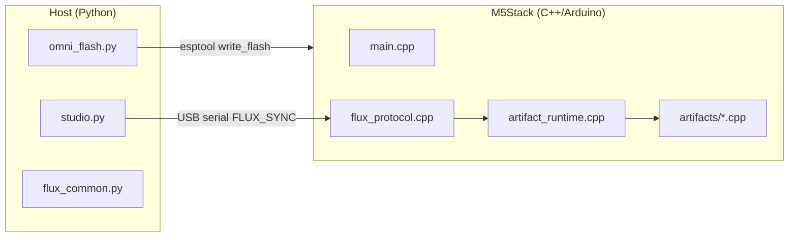

# M5-Utah 技術リファレンス

Flux デプロイメントスタックを拡張する開発者、メイカー、メンテナー向け。

---

## システムアーキテクチャ



### 2フェーズのライフサイクル

| フェーズ | ツール | 頻度 | 出力 |
|-------|------|-----------|--------|
| **Substrate flash（基板フラッシュ）** | `omni_flash.py` | ボードごとに1回（または後で OTA） | `m5_integrated_kernel.bin` @ 0x0 |
| **Manifest injection（マニフェストインジェクション）** | `studio.py` | アーティファクト切り替えのたび | シリアル経由の JSON → ランタイムディスパッチ |

---

## リポジトリレイアウト

```
M5-Utah/
├── host/
│   ├── flux_common.py      # プロトコル、VID/PID スキャン、マニフェスト I/O
│   ├── omni_flash.py       # esptool ラッパー
│   └── studio.py           # CLI インジェクター
├── firmware/M5IntegratedKernel/
│   ├── platformio.ini      # cores3 | core2 | atoms3 envs
│   ├── src/main.cpp
│   ├── src/flux_protocol.cpp
│   ├── src/artifact_runtime.cpp
│   └── src/artifacts/*.cpp
├── projects/*.flux.json
├── payloads/m5_integrated_kernel.bin
└── scripts/build_kernel.{ps1,sh}
```

親リポジトリの `*/ *_BLUEPRINT.json` と `*.cpp` / `*.py` スタブは**参照系譜**であり、直接コンパイルされません。

---

## シリアルプロトコル（Flux Sync）

| フィールド | フォーマット |
|-------|--------|
| 開始マーカー | ASCII `FLUX_SYNC_START`（15バイト） |
| ペイロード長 | `uint32` リトルエンディアン |
| ペイロード | UTF-8 JSON（ファームウェア内最大 8192 バイト） |
| 終了マーカー | ASCII `FLUX_SYNC_END`（13バイト） |

ホスト実装: `host/flux_common.py` → `transmit_manifest()`  
デバイス実装: `firmware/.../src/flux_protocol.cpp`

### ACK 行（モニター @ 115200）

インジェクション後、カーネルは以下を出力:

```
[FLUX] Manifest received
[FLUX] Manifesting: <display_name>
[FLUX] ACK: ARTIFACT_ACTIVE | ARTIFACT_FAILED
```

---

## マニフェストスキーマ（`.flux.json`）

必須キー:

```json
{
  "manifest_version": "1.0",
  "artifact_id": "snake_case_handler_id",
  "display_name": "Human label",
  "m5_hardware": { "device": "cores3|core2|atoms3", "modules": [] },
  "runtime": { "tasks": [] },
  "parameters": {}
}
```

オプションの系譜キー:

- `source_blueprint` — リポジトリルートからの相対パス
- `source_code` / `source_science`
- `archive_id`

### 登録済み `artifact_id` 値

| artifact_id | Handler | Source file |
|-------------|---------|-------------|
| `zero_point_gpu` | `zero_point_gpu_start` | `artifacts/zero_point_gpu.cpp` |
| `mnemonic_ddr_infinity` | `mnemonic_ddr_start` | `artifacts/mnemonic_ddr.cpp` |
| `psychotronic_amplifier_array` | `psychotronic_start` | `artifacts/psychotronic_amplifier.cpp` |
| `cellular_regenesis_chamber` | `chrono_heal_start` | `artifacts/chrono_heal.cpp` |
| `holographic_printing_press_v5` | `holographic_press_start` | `artifacts/holographic_press.cpp` |
| `ufw_tactical_command_table` | `war_room_start` | `artifacts/war_room.cpp` |

レジストリ: `src/artifact_runtime.cpp`

---

## ビルドとフラッシュ

### 前提条件

- [PlatformIO Core](https://platformio.org/)
- `requirements.txt` 付き Python 3.10+
- USB ドライバー: ボードに応じて CP210x、CH340、または CH9102

### カーネルのビルド

```powershell
cd M5-Utah
.\scripts\build_kernel.ps1 -Board cores3   # CoreS3 アーティファクト
.\scripts\build_kernel.ps1 -Board core2    # Core2 アーティファクト
.\scripts\build_kernel.ps1 -Board atoms3   # AtomS3 PAA
```

出力は `payloads/m5_integrated_kernel.bin` にコピーされます。

**注意:** ボードターゲットごとに1つのバイナリ。マニフェストの `m5_hardware.device` をフラッシュしたボードファミリーと一致させること。

### フラッシュ

```bash
py -3 run_omni_flash.py
py -3 run_omni_flash.py --port COM5
```

同梱 esptool パス: `M5-Utah/bin/esptool.exe`（オプション; PATH にフォールバック）。

### インジェクト

```bash
py -3 run_studio.py --artifact zero_point_gpu
py -3 run_studio.py --inject projects/Mnemonic_DDR_Infinity.flux.json
```

---

## ファームウェア内部

### ブートフロー（`main.cpp`）

1. `M5.begin()` — M5Unified がボードを自動検出
2. `Serial.begin(115200)`
3. `loop()` が `g_flux.poll(Serial)` をポーリング → `artifacts::start(manifest)`

### 新しいアーティファクトの追加

1. `src/artifacts/my_artifact.cpp` を作成:
   ```cpp
   namespace artifacts {
   bool my_artifact_start(const JsonDocument& manifest);
   void my_artifact_stop();
   }
   ```
2. `artifact_runtime.cpp` の `kHandlers[]` に登録
3. `projects/My_Artifact.flux.json` を追加
4. カーネルを再ビルド（ハンドラーはコンパイル済み; マニフェストがランタイムで選択）

### FreeRTOS タスクマップ

| Artifact | Tasks | Core pinning |
|----------|-------|----------------|
| ZPE GPU | `reality_engine`, `voxel_display` | 0 / 1 |
| DDR | `fsr_poll` | 1 |
| PAA | `paa_osc`, `paa_status` | 0 |
| Chrono Heal | `chrono_emit` | 1 |
| HPP | `hpp_compile` | 1 |
| War Room | `war_room` + ESP-NOW | 1 |

### I2C アドレス（コード内のデフォルト）

| Module | Address |
|--------|---------|
| PbHub | 0x61 |
| Unit-DAC | 0x60 |
| PAJ7620 Gesture | 0x73 |
| VL53L0X ToF | 0x29 |

ユニットのリビジョンに応じて M5Stack ドキュメントで確認すること。

---

## ホスト API（`flux_common.py`）

```python
from flux_common import (
    find_m5_port,
    list_flux_manifests,
    load_manifest,
    transmit_manifest,
    M5STACK_VID_PID,
)
```

### USB VID/PID テーブル

```python
(0x1A86, 0x55D4)  # CH9102F
(0x1A86, 0x7523)  # CH340
(0x0403, 0x6001)  # FT232R
(0x10C4, 0xEA60)  # CP210x
(0x303A, 0x1001)  # ESP32-S3 native USB
```

---

## パッケージング（PyInstaller）

```bash
pip install pyinstaller
pyinstaller --onefile host/omni_flash.py --name omni_flash --paths host
```

以下と一緒に配布:

- `payloads/m5_integrated_kernel.bin`
- `projects/*.flux.json`（studio または将来の GUI 用）

---

## ハードウェアなしでのテスト

```bash
py -3 run_studio.py --list
py -3 -c "from host.flux_common import load_manifest; print(load_manifest('projects/Zero_Point_GPU.flux.json')['artifact_id'])"
```

ファームウェア: PlatformIO `pio run -e cores3` コンパイルチェック。

シリアルループバックテスト: プロトコル仕様に従ったモックマニフェストバイトを UART テストハーネスに投入（リポジトリには未実装 — CI 追加の提案）。

---

## 既知の制限とロードマップ

| 項目 | ステータス |
|------|--------|
| PSRAM への真の JIT バイトコード | **未実装** — マニフェストはコンパイル済みハンドラーを設定 |
| OTA カーネル更新 | 計画中 |
| AtomS3 Lite ワーカーファームウェア（ESP-NOW スワーム） | オーバーロードのみ; ワーカーは別バイナリが必要 |
| クロスボード単一ユニバーサル .bin | 現状はターゲットごとのビルドが必要 |
| マニフェスト署名 / 認証 | 未実装 |

---

## オリジナルアーカイブと M5-Utah

- [オリジナル World-A アプローチ](07-ORIGINAL_WORLDA_APPROACH.md) — 27フォルダレイアウト、スタブ、架空ヘッダー
- [移行ガイド](06-MIGRATION_FROM_ORIGINAL.md) — アーティファクト別移植表とチェックリスト

親スタブ（`Reality_Engine.cpp` など）は**コンパイルされません**。系譜は `source_blueprint` / `source_code` マニフェストフィールドに保持されています。

## 関連ドキュメント

- [アーティファクトカタログ](ARTIFACTS.md)
- [科学者向け — 測定プロトコル](04-FOR_SCIENTISTS.md)
- [懐疑派向け — 主張の境界](05-FOR_SKEPTICS.md)
