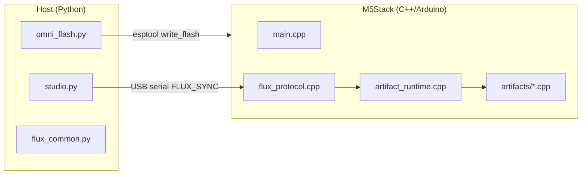

# Технический справочник M5-Utah

Для разработчиков, мейкеров и сопровождающих, расширяющих стек развёртывания Flux.

---

## Архитектура системы



### Двухфазный жизненный цикл

| Фаза | Инструмент | Частота | Результат |
|------|------------|---------|-----------|
| **Прошивка субстрата** | `omni_flash.py` | Один раз на плату (или OTA позже) | `m5_integrated_kernel.bin` @ 0x0 |
| **Инъекция манифеста** | `studio.py` | При каждой смене артефакта | JSON по serial → диспетчеризация runtime |

---

## Структура репозитория

```
M5-Utah/
├── host/
│   ├── flux_common.py      # Протокол, сканирование VID/PID, I/O манифестов
│   ├── omni_flash.py       # Обёртка esptool
│   └── studio.py           # CLI-инжектор
├── firmware/M5IntegratedKernel/
│   ├── platformio.ini      # окружения cores3 | core2 | atoms3
│   ├── src/main.cpp
│   ├── src/flux_protocol.cpp
│   ├── src/artifact_runtime.cpp
│   └── src/artifacts/*.cpp
├── projects/*.flux.json
├── payloads/m5_integrated_kernel.bin
└── scripts/build_kernel.{ps1,sh}
```

Родительские `*/ *_BLUEPRINT.json` и заглушки `*.cpp` / `*.py` — **справочная родословная**, не компилируются напрямую.

---

## Последовательный протокол (Flux Sync)

| Поле | Формат |
|------|--------|
| Маркер начала | ASCII `FLUX_SYNC_START` (15 байт) |
| Длина полезной нагрузки | `uint32` little-endian |
| Полезная нагрузка | UTF-8 JSON (макс. 8192 байта в прошивке) |
| Маркер конца | ASCII `FLUX_SYNC_END` (13 байт) |

Реализация на хосте: `host/flux_common.py` → `transmit_manifest()`  
Реализация на устройстве: `firmware/.../src/flux_protocol.cpp`

### Строки ACK (монитор @ 115200)

После инъекции ядро выводит:

```
[FLUX] Manifest received
[FLUX] Manifesting: <display_name>
[FLUX] ACK: ARTIFACT_ACTIVE | ARTIFACT_FAILED
```

---

## Схема манифеста (`.flux.json`)

Обязательные ключи:

```json
{
  "manifest_version": "1.0",
  "artifact_id": "snake_case_handler_id",
  "display_name": "Human label",
  "m5_hardware": { "device": "cores3|core2|atoms3", "modules": [] },
  "runtime": { "tasks": [] },
  "parameters": {}
}
```

Необязательные ключи родословной:

- `source_blueprint` — относительный путь от корня репозитория
- `source_code` / `source_science`
- `archive_id`

### Зарегистрированные значения `artifact_id`

| artifact_id | Обработчик | Исходный файл |
|-------------|------------|---------------|
| `zero_point_gpu` | `zero_point_gpu_start` | `artifacts/zero_point_gpu.cpp` |
| `mnemonic_ddr_infinity` | `mnemonic_ddr_start` | `artifacts/mnemonic_ddr.cpp` |
| `psychotronic_amplifier_array` | `psychotronic_start` | `artifacts/psychotronic_amplifier.cpp` |
| `cellular_regenesis_chamber` | `chrono_heal_start` | `artifacts/chrono_heal.cpp` |
| `holographic_printing_press_v5` | `holographic_press_start` | `artifacts/holographic_press.cpp` |
| `ufw_tactical_command_table` | `war_room_start` | `artifacts/war_room.cpp` |

Реестр: `src/artifact_runtime.cpp`

---

## Сборка и прошивка

### Предварительные требования

- [PlatformIO Core](https://platformio.org/)
- Python 3.10+ с `requirements.txt`
- USB-драйверы: CP210x, CH340 или CH9102 в зависимости от платы

### Сборка ядра

```powershell
cd M5-Utah
.\scripts\build_kernel.ps1 -Board cores3   # артефакты CoreS3
.\scripts\build_kernel.ps1 -Board core2    # артефакты Core2
.\scripts\build_kernel.ps1 -Board atoms3   # AtomS3 PAA
```

Результат копируется в `payloads/m5_integrated_kernel.bin`.

**Примечание:** Один бинарник на целевую плату. Сопоставьте `m5_hardware.device` манифеста с прошитым семейством плат.

### Прошивка

```bash
py -3 run_omni_flash.py
py -3 run_omni_flash.py --port COM5
```

Встроенный путь esptool: `M5-Utah/bin/esptool.exe` (необязательно; при отсутствии используется PATH).

### Инъекция

```bash
py -3 run_studio.py --artifact zero_point_gpu
py -3 run_studio.py --inject projects/Mnemonic_DDR_Infinity.flux.json
```

---

## Внутренности прошивки

### Поток загрузки (`main.cpp`)

1. `M5.begin()` — M5Unified автоматически определяет плату
2. `Serial.begin(115200)`
3. `loop()` опрашивает `g_flux.poll(Serial)` → `artifacts::start(manifest)`

### Добавление нового артефакта

1. Создайте `src/artifacts/my_artifact.cpp` с:
   ```cpp
   namespace artifacts {
   bool my_artifact_start(const JsonDocument& manifest);
   void my_artifact_stop();
   }
   ```
2. Зарегистрируйте в `artifact_runtime.cpp` в `kHandlers[]`
3. Добавьте `projects/My_Artifact.flux.json`
4. Пересоберите ядро (обработчик компилируется внутрь; манифест выбирает в runtime)

### Карта задач FreeRTOS

| Артефакт | Задачи | Привязка к ядру |
|----------|--------|-----------------|
| ZPE GPU | `reality_engine`, `voxel_display` | 0 / 1 |
| DDR | `fsr_poll` | 1 |
| PAA | `paa_osc`, `paa_status` | 0 |
| Chrono Heal | `chrono_emit` | 1 |
| HPP | `hpp_compile` | 1 |
| War Room | `war_room` + ESP-NOW | 1 |

### Адреса I2C (значения по умолчанию в коде)

| Модуль | Адрес |
|--------|-------|
| PbHub | 0x61 |
| Unit-DAC | 0x60 |
| PAJ7620 Gesture | 0x73 |
| VL53L0X ToF | 0x29 |

Сверьте с документацией M5Stack для вашей ревизии модуля.

---

## API хоста (`flux_common.py`)

```python
from flux_common import (
    find_m5_port,
    list_flux_manifests,
    load_manifest,
    transmit_manifest,
    M5STACK_VID_PID,
)
```

### Таблица USB VID/PID

```python
(0x1A86, 0x55D4)  # CH9102F
(0x1A86, 0x7523)  # CH340
(0x0403, 0x6001)  # FT232R
(0x10C4, 0xEA60)  # CP210x
(0x303A, 0x1001)  # ESP32-S3 native USB
```

---

## Упаковка (PyInstaller)

```bash
pip install pyinstaller
pyinstaller --onefile host/omni_flash.py --name omni_flash --paths host
```

Поставляйте вместе с:

- `payloads/m5_integrated_kernel.bin`
- `projects/*.flux.json` (для studio или будущего GUI)

---

## Тестирование без оборудования

```bash
py -3 run_studio.py --list
py -3 -c "from host.flux_common import load_manifest; print(load_manifest('projects/Zero_Point_GPU.flux.json')['artifact_id'])"
```

Прошивка: проверка компиляции PlatformIO `pio run -e cores3`.

Serial loopback-тест: mock-байты манифеста по спецификации протокола в UART test harness (ещё не в репозитории — предлагаемое дополнение CI).

---

## Известные ограничения и дорожная карта

| Пункт | Статус |
|-------|--------|
| Настоящий JIT-байткод в PSRAM | **Не реализовано** — манифесты настраивают скомпилированные обработчики |
| OTA-обновление ядра | Запланировано |
| Прошивка worker AtomS3 Lite (ESP-NOW swarm) | Только Overlord; workers нужен отдельный бинарник |
| Универсальный .bin для всех плат | Сегодня требуются сборки под каждую цель |
| Подпись / аутентификация манифеста | Не реализовано |

---

## Оригинальный архив и M5-Utah

- [Оригинальный подход World-A](07-ORIGINAL_WORLDA_APPROACH.md) — структура из 27 папок, заглушки, вымышленные заголовки
- [Руководство по миграции](06-MIGRATION_FROM_ORIGINAL.md) — таблица портирования по артефактам и чеклист

Родительские заглушки (`Reality_Engine.cpp` и т.д.) **не компилируются**. Родословная сохраняется в полях манифеста `source_blueprint` / `source_code`.

## Связанные документы

- [Каталог артефактов](ARTIFACTS.md)
- [Для учёных — протоколы измерений](04-FOR_SCIENTISTS.md)
- [Для скептиков — границы утверждений](05-FOR_SKEPTICS.md)
