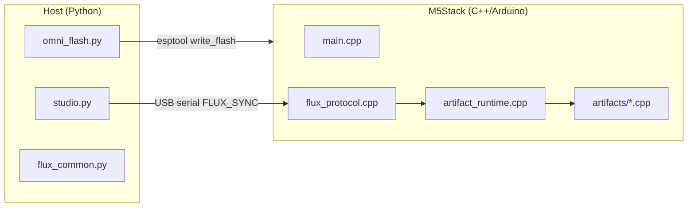

# M5-Utah 技术参考

面向开发者、创客及维护 Flux 部署栈的人员。

---

## 系统架构



### 两阶段生命周期

| 阶段 | 工具 | 频率 | 输出 |
|------|------|------|------|
| **基底刷写** | `omni_flash.py` | 每块板一次（或日后 OTA） | `m5_integrated_kernel.bin` @ 0x0 |
| **Manifest 注入** | `studio.py` | 每次切换 artifact | 串口 JSON → 运行时分发 |

---

## 仓库布局

```
M5-Utah/
├── host/
│   ├── flux_common.py      # 协议、VID/PID 扫描、manifest I/O
│   ├── omni_flash.py       # esptool 封装
│   └── studio.py           # CLI 注入器
├── firmware/M5IntegratedKernel/
│   ├── platformio.ini      # cores3 | core2 | atoms3 envs
│   ├── src/main.cpp
│   ├── src/flux_protocol.cpp
│   ├── src/artifact_runtime.cpp
│   └── src/artifacts/*.cpp
├── projects/*.flux.json
├── payloads/m5_integrated_kernel.bin
└── scripts/build_kernel.{ps1,sh}
```

父仓库中的 `*/ *_BLUEPRINT.json` 与 `*.cpp` / `*.py` 桩代码为**参考谱系**，不直接参与编译。

---

## 串口协议（Flux Sync）

| 字段 | 格式 |
|------|------|
| 起始标记 | ASCII `FLUX_SYNC_START`（15 字节） |
| 载荷长度 | `uint32` 小端 |
| 载荷 | UTF-8 JSON（固件中最大 8192 字节） |
| 结束标记 | ASCII `FLUX_SYNC_END`（13 字节） |

主机实现：`host/flux_common.py` → `transmit_manifest()`  
设备实现：`firmware/.../src/flux_protocol.cpp`

### ACK 行（监视器 @ 115200）

注入后，kernel 打印：

```
[FLUX] Manifest received
[FLUX] Manifesting: <display_name>
[FLUX] ACK: ARTIFACT_ACTIVE | ARTIFACT_FAILED
```

---

## Manifest 模式（`.flux.json`）

必需键：

```json
{
  "manifest_version": "1.0",
  "artifact_id": "snake_case_handler_id",
  "display_name": "Human label",
  "m5_hardware": { "device": "cores3|core2|atoms3", "modules": [] },
  "runtime": { "tasks": [] },
  "parameters": {}
}
```

可选谱系键：

- `source_blueprint` — 相对仓库根的路径
- `source_code` / `source_science`
- `archive_id`

### 已注册的 `artifact_id` 值

| artifact_id | Handler | 源文件 |
|-------------|---------|--------|
| `zero_point_gpu` | `zero_point_gpu_start` | `artifacts/zero_point_gpu.cpp` |
| `mnemonic_ddr_infinity` | `mnemonic_ddr_start` | `artifacts/mnemonic_ddr.cpp` |
| `psychotronic_amplifier_array` | `psychotronic_start` | `artifacts/psychotronic_amplifier.cpp` |
| `cellular_regenesis_chamber` | `chrono_heal_start` | `artifacts/chrono_heal.cpp` |
| `holographic_printing_press_v5` | `holographic_press_start` | `artifacts/holographic_press.cpp` |
| `ufw_tactical_command_table` | `war_room_start` | `artifacts/war_room.cpp` |

注册表：`src/artifact_runtime.cpp`

---

## 编译与刷写

### 前置条件

- [PlatformIO Core](https://platformio.org/)
- Python 3.10+ 与 `requirements.txt`
- USB 驱动：依板型为 CP210x、CH340 或 CH9102

### 编译 kernel

```powershell
cd M5-Utah
.\scripts\build_kernel.ps1 -Board cores3   # CoreS3 artifact
.\scripts\build_kernel.ps1 -Board core2    # Core2 artifact
.\scripts\build_kernel.ps1 -Board atoms3   # AtomS3 PAA
```

输出复制到 `payloads/m5_integrated_kernel.bin`。

**注意：** 每个板型目标一个二进制。manifest 的 `m5_hardware.device` 须与已刷写板族匹配。

### 刷写

```bash
py -3 run_omni_flash.py
py -3 run_omni_flash.py --port COM5
```

捆绑 esptool 路径：`M5-Utah/bin/esptool.exe`（可选；回退到 PATH）。

### 注入

```bash
py -3 run_studio.py --artifact zero_point_gpu
py -3 run_studio.py --inject projects/Mnemonic_DDR_Infinity.flux.json
```

---

## 固件内部

### 启动流程（`main.cpp`）

1. `M5.begin()` — M5Unified 自动检测板型
2. `Serial.begin(115200)`
3. `loop()` 轮询 `g_flux.poll(Serial)` → `artifacts::start(manifest)`

### 添加新 artifact

1. 创建 `src/artifacts/my_artifact.cpp`，包含：
   ```cpp
   namespace artifacts {
   bool my_artifact_start(const JsonDocument& manifest);
   void my_artifact_stop();
   }
   ```
2. 在 `artifact_runtime.cpp` 的 `kHandlers[]` 中注册
3. 添加 `projects/My_Artifact.flux.json`
4. 重新编译 kernel（handler 已编译进固件；manifest 在运行时选择）

### FreeRTOS 任务映射

| Artifact | 任务 | 核心绑定 |
|----------|------|----------|
| ZPE GPU | `reality_engine`, `voxel_display` | 0 / 1 |
| DDR | `fsr_poll` | 1 |
| PAA | `paa_osc`, `paa_status` | 0 |
| Chrono Heal | `chrono_emit` | 1 |
| HPP | `hpp_compile` | 1 |
| War Room | `war_room` + ESP-NOW | 1 |

### I2C 地址（代码默认值）

| 模块 | 地址 |
|------|------|
| PbHub | 0x61 |
| Unit-DAC | 0x60 |
| PAJ7620 Gesture | 0x73 |
| VL53L0X ToF | 0x29 |

请对照你所用单元版本的 M5Stack 文档核实。

---

## 主机 API（`flux_common.py`）

```python
from flux_common import (
    find_m5_port,
    list_flux_manifests,
    load_manifest,
    transmit_manifest,
    M5STACK_VID_PID,
)
```

### USB VID/PID 表

```python
(0x1A86, 0x55D4)  # CH9102F
(0x1A86, 0x7523)  # CH340
(0x0403, 0x6001)  # FT232R
(0x10C4, 0xEA60)  # CP210x
(0x303A, 0x1001)  # ESP32-S3 native USB
```

---

## 打包（PyInstaller）

```bash
pip install pyinstaller
pyinstaller --onefile host/omni_flash.py --name omni_flash --paths host
```

一并分发：

- `payloads/m5_integrated_kernel.bin`
- `projects/*.flux.json`（供 studio 或未来 GUI 使用）

---

## 无硬件测试

```bash
py -3 run_studio.py --list
py -3 -c "from host.flux_common import load_manifest; print(load_manifest('projects/Zero_Point_GPU.flux.json')['artifact_id'])"
```

固件：PlatformIO `pio run -e cores3` 编译检查。

串口回环测试：按协议规范将 mock manifest 字节送入 UART 测试框架（仓库中尚未包含 — 建议加入 CI）。

---

## 已知限制与路线图

| 项目 | 状态 |
|------|------|
| 向 PSRAM 真正 JIT 字节码 | **未实现** — manifest 配置已编译的 handler |
| OTA kernel 更新 | 计划中 |
| AtomS3 Lite worker 固件（ESP-NOW 集群） | 仅 Overlord；worker 需单独二进制 |
| 跨板型单一通用 .bin | 目前需按目标分别编译 |
| Manifest 签名 / 认证 | 未实现 |

---

## 原始档案 vs M5-Utah

- [原版 World-A 方案](07-ORIGINAL_WORLDA_APPROACH.md) — 27 文件夹布局、桩代码、虚构头文件
- [迁移指南](06-MIGRATION_FROM_ORIGINAL.md) — 按 artifact 的移植表与检查清单

父仓库桩代码（`Reality_Engine.cpp` 等）**不参与编译**。谱系保存在 manifest 的 `source_blueprint` / `source_code` 字段中。

## 相关文档

- [Artifact 目录](ARTIFACTS.md)
- [科学家 — 测量协议](04-FOR_SCIENTISTS.md)
- [怀疑者 — 主张边界](05-FOR_SKEPTICS.md)
