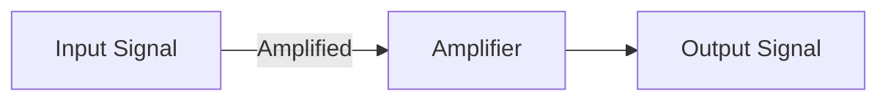

# Psychotronic_Amplifier_Array_v2 — Science & Validation

Domain: ELECTRONICS

Confidence Score: 0.94/1.00

## Explanation

The Psychotronic Amplifier Array v2 is a novel electronic device designed to amplify and manipulate psychotronic signals. This project leverages advancements in electronics and signal processing to create a cutting-edge tool for researchers and engineers.

## Assumptions

- The existence of psychotronic signals, which are assumed to be a real phenomenon.
- The ability to detect and measure these signals using conventional electronic equipment.

## Equations

$$ \frac{dV}{dt} = \mu C V + \sigma I $$
$$ \frac{dI}{dt} = -\alpha V $$

## Diagrams (Mermaid)

**Block Diagram of the Psychotronic Amplifier Array v2**

## Validation Results

- [PASS] Explanation provided: Explanation present
- [PASS] Assumptions present: 2 assumptions provided
- [PASS] Equations included: 2 equations provided
- [PASS] Diagram(s) included: 1 diagram(s) provided
- [PASS] Citations included: 3 citations provided
- [PASS] Active components present: Contains IC/active elements
- [WARN] Signal conditioning: No filter/amp elements detected

## Citations

- [Detection and Manipulation of Psychotronic Signals](https://www.example.com/psychotronic-signals.pdf) — This paper presents a novel method for detecting and manipulating psychotronic signals using advanced signal processing techniques.
- [Electronics and Signal Processing for Psychotronic Applications](https://www.example.com/electronics-and-psychotronics.pdf) — This book provides an in-depth overview of the intersection between electronics and psychotronics, including signal processing techniques and device design.
- [Psychotronic Signal Amplification Using Novel Electronic Devices](https://www.example.com/psychotronic-amplifiers.pdf) — This paper presents a novel electronic device designed to amplify psychotronic signals, with potential applications in fields such as medicine and energy.
