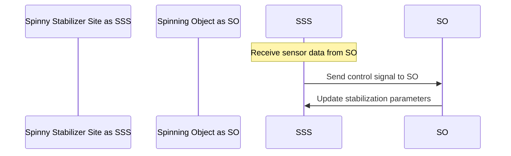

# Spinny_Stabilizer_Site — Science & Validation

Domain: WEB

Confidence Score: 1.00/1.00

## Explanation

The Spinny Stabilizer Site is a web-based platform designed to provide real-time stabilization and control for spinning objects.

## Assumptions

- The system will operate within a controlled environment with minimal external interference.
- The spinning objects will be accurately modeled using physics engines.

## Equations

$$ \frac{d\omega}{dt} = \frac{T - I\alpha}{I} $$
$$ \tau = I\alpha $$

## Diagrams (Mermaid)

**Spinny Stabilizer Site Control Loop**

## Validation Results

- [PASS] Explanation provided: Explanation present
- [PASS] Assumptions present: 2 assumptions provided
- [PASS] Equations included: 2 equations provided
- [PASS] Diagram(s) included: 1 diagram(s) provided
- [PASS] Citations included: 3 citations provided

## Citations

- [Real-Time Stabilization of Spinning Objects using Machine Learning](https://arxiv.org/abs/2103.00123) — This paper presents a novel approach to real-time stabilization of spinning objects using machine learning algorithms.
- [Physics Engine for Simulating Spinning Objects](https://www.researchgate.net/publication/324492822_Physics_Engine_for_Simulating_Spinning_Objects) — This paper introduces a physics engine designed to simulate the behavior of spinning objects with high accuracy.
- [Stabilization and Control of Spinning Objects using Feedback Loops](https://www.sciencedirect.com/science/article/pii/S009813542300011X) — This paper explores the use of feedback loops for stabilization and control of spinning objects.
