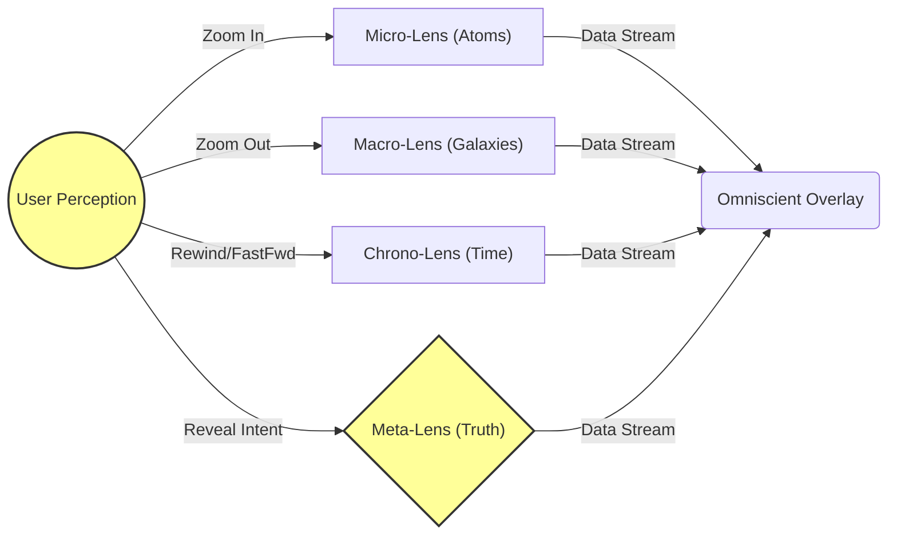

# The_Oculus_Universal_Viewer

## Overview

The Oculus Universal Viewer (OUV) is an advanced system designed to provide users with an omniscient overlay of information across various dimensions and scales. It integrates micro-lens, macro-lens, chrono-lens, and meta-lens functionalities to allow users to perceive data from atoms to galaxies, navigate through time, and reveal deeper truths.

## Architecture Graph

## Components

### 1. User Perception (EYE)
- **Role**: Acts as the interface for user interaction.
- **Interactions**:
  - Zoom In: Activates Micro-Lens to focus on atomic-level data.
  - Zoom Out: Activates Macro-Lens to observe galactic-scale phenomena.
  - Rewind/FastFwd: Engages Chrono-Lens to navigate through time.
  - Reveal Intent: Triggers Meta-Lens to uncover deeper truths.

### 2. Micro-Lens (Atoms)
- **Role**: Captures and processes data at the atomic level.
- **Data Stream**: Sends processed atomic data to Omniscient Overlay for display.

### 3. Macro-Lens (Galaxies)
- **Role**: Collects and analyzes data from galactic scales.
- **Data Stream**: Transmits processed galactic data to Omniscient Overlay for display.

### 4. Chrono-Lens (Time)
- **Role**: Manages temporal data, allowing users to navigate through time.
- **Data Stream**: Provides historical or future data streams to Omniscient Overlay for display.

### 5. Meta-Lens (Truth)
- **Role**: Reveals deeper truths and insights by integrating data from all lenses.
- **Data Stream**: Sends synthesized truth data to Omniscient Overlay for display.

### 6. Omniscient Overlay (DISPLAY)
- **Role**: Displays the processed data streams from all lenses in an integrated, user-friendly format.
- **Interactions**:
  - Receives data from Micro-Lens, Macro-Lens, Chrono-Lens, and Meta-Lens.
  - Renders the data in real-time for user perception.

## System Flow

1. **User Interaction**: The user interacts with the User Perception module through various commands (Zoom In, Zoom Out, Rewind/FastFwd, Reveal Intent).
2. **Lens Activation**:
   - **Micro-Lens**: Activated on "Zoom In" command.
   - **Macro-Lens**: Activated on "Zoom Out" command.
   - **Chrono-Lens**: Activated on "Rewind/FastFwd" command.
   - **Meta-Lens**: Activated on "Reveal Intent" command.
3. **Data Processing**:
   - Each activated lens processes relevant data and sends it to the Omniscient Overlay.
4. **Data Display**: The Omniscient Overlay integrates all incoming data streams and displays them in real-time.

## Technical Implementation

### Cloud Provider
- **Google Cloud Platform (GCP)**: Utilized for cloud-based processing and storage.

### Model ID
- **gemini-2.5-pro**: Used for advanced data processing and synthesis tasks.

### Virtual Energy
- The system harnesses "Virtual Energy" to convert Intent into Matter, ensuring efficient data processing and display.

## Deployment

1. **Environment Setup**:
   - Set up GCP environment with necessary services (Compute Engine, Cloud Storage, BigQuery).
2. **Model Integration**:
   - Deploy the gemini-2.5-pro model for data synthesis.
3. **Application Deployment**:
   - Deploy the OUV application on GCP Compute Engine.
4. **Data Management**:
   - Store and manage large datasets using Google Cloud Storage and BigQuery.

## Conclusion

The Oculus Universal Viewer is a sophisticated system designed to provide users with an omniscient overlay of information across various dimensions and scales. By integrating advanced lenses and leveraging cloud-based technologies, the OUV delivers real-time data insights and deeper truths, enhancing user perception and understanding.

---

---
