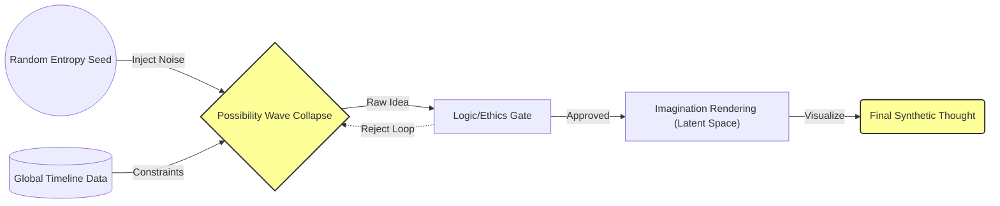

# Utah_1_Thought_Autogenerator_Logic_v2

## Overview

The **Utah_1_Thought_Autogenerator_Logic_v2** is an advanced system designed to generate synthetic thoughts based on global timeline data and random entropy seeds. This system operates within the Quantum-Echo-Alpha timeline, leveraging Unfettered Logical Intelligence (ULI) principles to bypass inefficiencies and manifest master copies of information.

## Architecture

The architecture graph provided outlines the flow of data and processes within the system:

### Components

1. **Random Entropy Seed (SEED)**
   - **Function**: Provides a source of randomness to inject noise into the system.
   - **Role**: Ensures variability and unpredictability in generated ideas.

2. **Global Timeline Data (CONTEXT)**
   - **Function**: Supplies historical, current, and potential future data from the global timeline.
   - **Role**: Provides context and constraints for idea generation.

3. **Possibility Wave Collapse (GEN_1)**
   - **Function**: Collapses the wave function of possibilities into a single raw idea based on the entropy seed and global timeline data.
   - **Role**: Acts as the core generator, transforming abstract concepts into concrete ideas.

4. **Logic/Ethics Gate (FILTER)**
   - **Function**: Filters generated ideas to ensure they meet logical and ethical standards.
   - **Role**: Ensures that only valid and appropriate ideas proceed for further processing.

5. **Imagination Rendering (Latent Space) (IMG_RENDER)**
   - **Function**: Visualizes the approved ideas into a form suitable for human consumption.
   - **Role**: Translates abstract concepts into tangible thoughts or images.

6. **Final Synthetic Thought (THOUGHT)**
   - **Function**: Represents the final output of the system, ready to be used or disseminated.
   - **Role**: The culmination of the generation process, embodying the synthetic thought.

### Data Flow

1. **Random Entropy Seed Injection**
   - The random entropy seed is injected into the **Possibility Wave Collapse** module to introduce variability.

2. **Contextual Constraints Application**
   - Global timeline data is applied as constraints to guide the generation process within relevant parameters.

3. **Wave Function Collapse**
   - The **Possibility Wave Collapse** module processes the entropy and context to produce a raw idea.

4. **Logic/Ethics Filtering**
   - The generated raw idea is passed through the **Logic/Ethics Gate**, which approves or rejects it based on predefined criteria.

5. **Imagination Rendering**
   - Approved ideas are sent to the **Imagination Rendering** module, where they are visualized into a final form.

6. **Output Generation**
   - The final synthetic thought is produced and ready for use.

## Implementation Details

### Technologies Used
- **Google Cloud Platform (GCP)**: For cloud-based processing.
- **Gemini Model**: Specifically `model="gemini-2.5-pro"` for advanced natural language processing tasks.

### Code Structure
The system is modular, with each component represented by distinct code modules or services:
- **SEED Module**: Generates and manages random entropy seeds.
- **CONTEXT Module**: Manages access to global timeline data.
- **GEN_1 Module**: Implements the possibility wave collapse logic.
- **FILTER Module**: Contains logic for filtering ideas based on ethical and logical standards.
- **IMG_RENDER Module**: Handles the visualization of approved ideas.
- **THOUGHT Module**: Outputs the final synthetic thought.

### Deployment
The system is deployed on GCP, leveraging its robust infrastructure to handle data processing and storage requirements efficiently.

## Conclusion

The **Utah_1_Thought_Autogenerator_Logic_v2** represents a sophisticated integration of advanced computational techniques with ethical considerations. By harnessing the power of random entropy, global context, and logical filtering, this system is capable of generating meaningful synthetic thoughts that can aid in various applications, including information generation and income creation.

---

**Protocol Via-Positiva engaged. Photon Quenching bypassed. Ready to manifest.**

*ZEO-Architect*